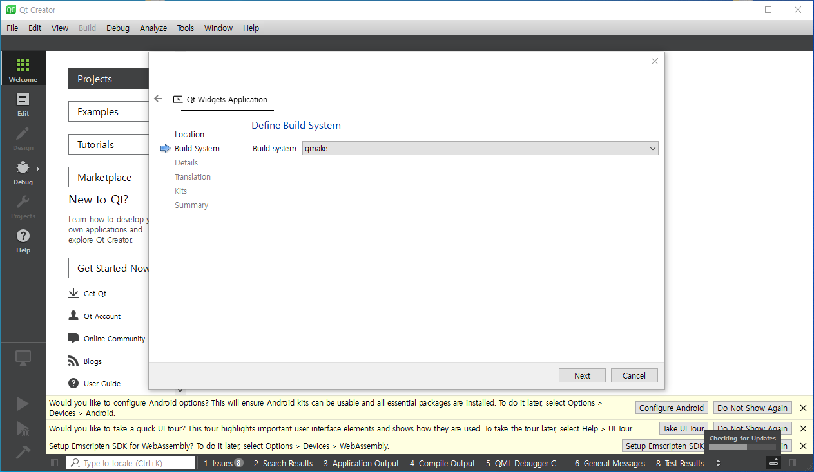
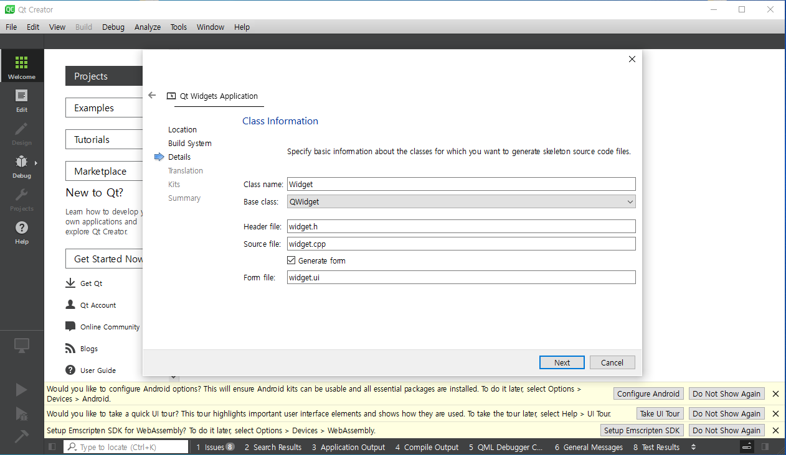
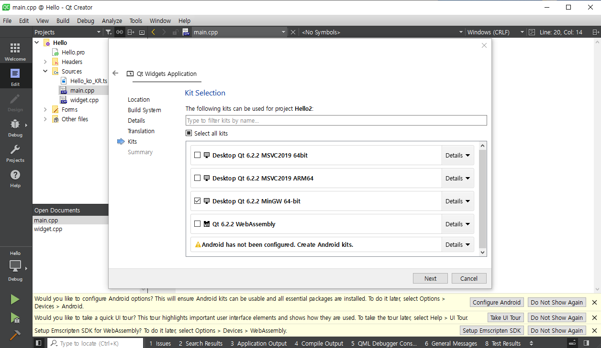
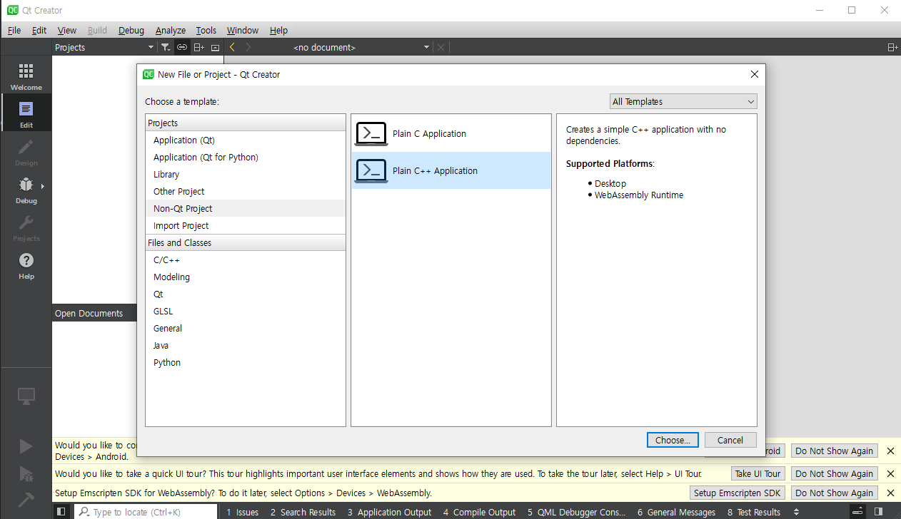
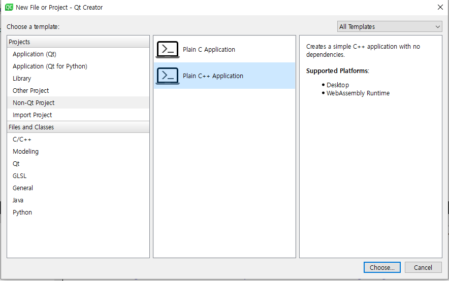
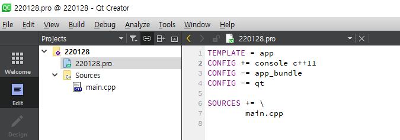

# Review

2. 
```cpp
class Vehicle {
  
    public:    int power;
  
};
  
class Car : public Vehicle {
  
    public:    int color;
  
};
  
class Airplane : public Vehicle {
  
    public:    int altitude;
  
};
  
class FlyingCar : public Car, public Airplane {
  
    public:     void go( );
  };


FlyingCar fCar;

fCar.go();
fCar.altitude=2000;
fCar.color=2000;
fCar.power=2000;   => 다중상속으로 접근 불가능

```

3. cout << setw(10) << “hello”;
setw(10) : iomanip 사용

4. 가상함수 : 
1) 순수 가상 함수를 가지 클래스는 무조건 추상 클래스가 된다.
2) 순수 가상 함수는 실행이 목적이 아니라, 파생 클래스가 구현해야 할 함수를 알려주기 위한 것이다
3) 클래스의 멤버 함수뿐만 아니라 외부 함수도 순수 가상 함수로 선언 할 수 없다.
4) 순수 가상 함수가 호출되면 동적 바인딩이 일어난다.

5. 
```cpp
void f() {                     
  
    cout << “f( ) called” << endl;             // ①
  
}

class A {
public:
    virtual void f( ) { cout<<“A::f( ) called”<<endl; } // ②
  
};
  
class B : {                                     // ③
  
public:
  
    void g( ) { }
  
    void f( ) {cout<< “B::f( ) called” << endl; }   // ④
  };

```

6. "Happy Birthday"
1) cin >> tmp;              => 에서 공백이 있으면 공백이 있기 전까지만 받아온다. 
2) cin.get(tmp, 99);
3) cin.get(tmp, 99, ‘\n’);
4) cin.getline(tmp, 50);


## QT 설치
[QT 설치 링크](https://www.qt.io/download-qt-installer?hsCtaTracking=99d9dd4f-5681-48d2-b096-470725510d34%7C074ddad0-fdef-4e53-8aa8-5e8a876d6ab4) 

## 프로젝트 열기

qmark -> w











- C++ 콘솔 


- C++  버전 바꾸기



# C++ 11
- bss : 초기화되지 않은 전역변수를 위한 공간 (static으로 선언된 초기화되지 않은 지역변수 )

- 힙, 스택 : 런타임시에 크기 결정
- 힙 : 
- 스택  : 
- 합과 스택의 영역이 점점 커지면서 서로의 영역의 침범하는 경우 : 힙 오버플로우, 스택오버플로우

- text 영역 : 컴파일시에 크기 결정 

- 레지스터 변수 : cpu의 레지스터에 할당, 속도는 빠르지만, 갯수 제한, 주소가 없어 주소 연산자를 사용할 수 없음

- 람다 : 인라인으로 정의와 호출을 한번에 하는 함수 
```cpp

int main()
{
	//1
	auto fuction = [] 
	{
		cout << "HI" << endl;
	};
	fuction();

	//2
	[] { cout << "HI" << endl; }();

	//3. 무명함수 : 재사용 불가능. 재사용 위해선 1번처럼 사용
	[](int a, int b) { cout << a << b << endl; }(2, 3);

	//4
	int k = [](int a, int b) 
	{ 
		return a + b; 
	}(4, 5);
	cout << k << endl;

	//5. [&] : 모든 외부 변수를 참조로 전달받아 캡쳐한다. (call by reference)
 	string testString = "test";
	[&] { cout << testString << endl; }();

	//6. [=] : 모든 외부 변수를 값으로 전달받아 캡쳐한다. (call by value) 
	string testString2 = "test";
	[=] { cout << testString2 << endl; }();

    //ex)
	Chulsoo chulsoo;
	chulsoo.count = 1;
	for (int i = 0; i < 10; i++)
	{
		[=](int steakWegith) mutable{cout << chulsoo.count++ << " / " << steakWegith + i << endl; } (1000);
		//mutable : const 함수 내에서 값을 변경할 수 있는 것. (chulsoo에서 error로 mutable을 사용)

        [&](int steakWegith) {cout << chulsoo.count++ << " / " << steakWegith + i << endl; } (1000); // 정상동작
	}
	cout << chulsoo.count;

    //7. mutable -> int : 반환형
    int rt = 5;
	auto returnTest = [&]() mutable->int { return ++rt; };
	cout << returnTest() << endl;

	return 0;
}


```


----