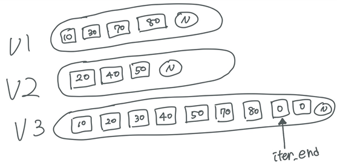

# Modifying algorirhms
원소의 값이 변경 되거나 목적지 순차열로 원소를 복사하는 알고리즘

## copy(b, e, b')
- [b, e)의 순차열을 b'로 덮어쓴다. 
- v2.size는 v1보다 커야한다.
- v2의 주소에 v1의 값을 복사하는 방식 -> v2의 주소는 바뀌지 않는다.
- copy 의 반환값으로 받는 iterator는 v2의 복사한 그 다음 원소를 가리킨다. </br>
(만약 크기가 같다면 copy의 return iterator는 v2.end()를 가리키고 있음.)

EX)
```cpp
#include <iostream>
#include <vector>
#include <algorithm>
using namespace std;

void main()
{
    vector<int> v1;
    v1.push_back(10);
    v1.push_back(20);
    v1.push_back(30);
    v1.push_back(40);
    v1.push_back(50);


    vector<int> v2(6, 3); //size 6인 vector 생성
    cout << "v2 : ";
    for (vector<int>::size_type i = 0; i < v2.size(); ++i)  // v2 확인
        cout << "(" << v2[i] << " / " << &v2[i] << ") ";
    cout << endl;

    vector<int>::iterator iter = copy(v1.begin(), v1.end(), v2.begin()); //v1을 v2로 카피
    cout << "v2 마지막 원소: " << *(iter - 1) << endl;

    cout << "v1 : ";
    for (vector<int>::size_type i = 0; i < v1.size(); ++i)
        cout << "(" << v1[i] << " / " << &v1[i] << ") ";
    cout << endl;
    cout << "v2 : ";
    for (vector<int>::size_type i = 0; i < v2.size(); ++i)
        cout << "(" << v2[i] << " / " << &v2[i] << ") ";
    cout << endl;
}
```
출력 결과
```
v2 : (33 / 000002E041A1D160) (33 / 000002E041A1D164) (33 / 000002E041A1D168) (33 / 000002E041A1D16C) (33 / 000002E041A1D170) (33 / 000002E041A1D174)
v2 마지막 원소: 50
v1 : (10 / 000002E041A1DD60) (20 / 000002E041A1DD64) (30 / 000002E041A1DD68) (40 / 000002E041A1DD6C) (50 / 000002E041A1DD70)
v2 : (10 / 000002E041A1D160) (20 / 000002E041A1D164) (30 / 000002E041A1D168) (40 / 000002E041A1D16C) (50 / 000002E041A1D170) (33 / 000002E041A1D174)
```

### copy_backword()
순차열의 마지막 원소부터 다른 순차열의 뒤에서부터 복사 

## for_each(b, e, f)
[b, e) 구간의 iterator가 p일때, 모든 원소에 대해 f(*p) 적용한다. 

EX)
```cpp
void Func(int& r)
{
    r += 5;
}
void main( )
{
    vector<int> v;
    v.push_back(10);
    v.push_back(20);
    v.push_back(30);
    v.push_back(40);
    v.push_back(50);

    cout << "v : ";
    for(vector<int>::size_type i = 0; i < v.size(); ++i)    // v : 10 20 30 40 50
        cout << v[i] <<" ";
    cout << endl;


    for_each(v.begin(), v.end(), Func);
    cout << "v : ";
    for(vector<int>::size_type i = 0; i < v.size(); ++i)    // v : 15 25 35 45 55
        cout << v[i] <<" ";
    cout << endl;
}
```
### functor 사용 예시
```cpp
class Add
{
    int a;
public:
    explicit Add(int _a = 0) :a(_a) { }
    void operator()(int& r)
    {
        r += a;
    }
};
void main()
{
    vector<int> v;
    v.push_back(1);
    v.push_back(2);
    v.push_back(3);
    v.push_back(4);
    v.push_back(5);

    for (vector<int>::size_type i = 0; i < v.size(); ++i)
        cout << v[i] << " ";
    cout << endl;

    for_each(v.begin(), v.end(), Add(3));

    for (vector<int>::size_type i = 0; i < v.size(); ++i)
        cout << v[i] << " ";
    cout << endl;
}
```

## generate(b, e, f)
[b, e) 구간의 모든 원소를 동일한 값(f())으로 수정

## swap(a, b) / iter_swap(p, q)
- swap(a, b) : value a와 b 교환
- iter_swap(p, q) : iterator가 가리키는 *p와 *q를 교환

## merge(b, e, b', e', t, (f))
- 정렬된 두 순차열을 하나의 정렬된 순차열로 합병(덮어쓰기)
- [b, e)와 [b', e')의 순차열을 [t, t + (e - b) + (e' - b'))의 순차열로 합병 정렬 한다. 


## replace(b, e, x1, x2) / replace_if(b, e, f, x2)
- 순차열의 특정 원소를 다른 값으로 수정
- replace_if(b, e, f, x2) : 순차열의 특정 구간에서 f 조건에서 true인 모든 원소의 값을 수정

### replace_copy(b1, e1, b2, value(f), value2)
- 변환하여 다른 순차열에 저장 
- v1의 value와 같거나 f()의 return이 true인 값을 value2로 바꾸어 v2에 저장한다. 

## swap_ranges(b, e, b')
- 순차열의 모든 원소 교환
- 덮어쓰기 모드로 동작한다. 
```cpp
#include <iostream>
#include <vector>
#include <algorithm>
using namespace std;

void main()
{
    vector<int> v1;
    v1.push_back(10);
    v1.push_back(20);
    v1.push_back(30);
    v1.push_back(40);
    v1.push_back(50);

    vector<int> v2;
    v2.push_back(11);
    v2.push_back(22);
    v2.push_back(33);
    v2.push_back(44);
    v2.push_back(55);

    cout << "v1 : ";
    for (vector<int>::size_type i = 0; i < v1.size(); ++i)
        cout << v1[i] << " ";
    cout << endl;
    cout << "v2 : ";
    for (vector<int>::size_type i = 0; i < v2.size(); ++i)
        cout << v2[i] << " ";
    cout << endl;

    swap_ranges(v1.begin(), v1.end(), v2.begin());  //v2의 크기가 v1보다 작으면 에러

    cout << endl << "v1 : ";
    for (vector<int>::size_type i = 0; i < v1.size(); ++i)
        cout << v1[i] << " ";
    cout << endl;
    cout << "v2 : ";
    for (vector<int>::size_type i = 0; i < v2.size(); ++i)
        cout << v2[i] << " ";
    cout << endl;
}
```

## transform(b, e, t, f(*p))
- 순차열의 모든 원소를 원본의 변화 없이 목적지의 순차열로 저장
- transform(v.begin(), v.end(), v2.begin(), f());
- return iterator는 t의 v1을 모두 복사하고 난 다음 인자를 가리킴
```cpp
transform(v1.begin(), v1.end(), v2.begin(), [](int a) { return a + 3; });
```

### transform(b, e, b2, t, f(*p, *q))
- v1과 v2의 iterator p, q를 f(*p, *q)한 값을 순차열 t에 저장
- return iterator는 t의 v1을 모두 복사하고 난 다음 인자를 가리킴


